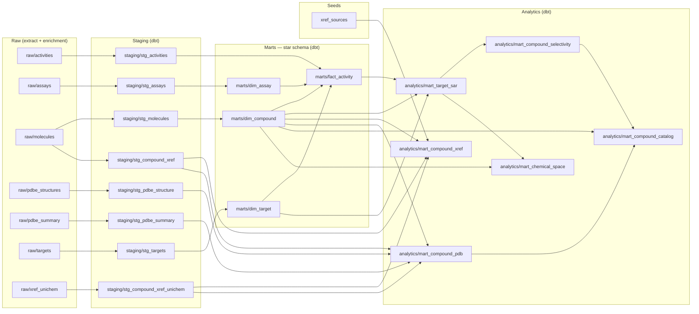

# Orchestration (Dagster)

The end-to-end pipeline is modelled as a Dagster **asset graph** so the medallion
lineage is explicit, materialisable, and observable. Every dbt model is an asset and
every dbt test is an asset check (via `dagster-dbt`), with two extra warehouse-level
checks on top.

## Assets & lineage

- **Governed raw roots** — `chembl_raw_extract` is a multi-asset that runs the scoped
  ChEMBL extract (`python -m extract.run`) and publishes `raw/activities`,
  `raw/molecules`, `raw/targets`, `raw/assays`.
- **Enrichment sources** — `raw/xref_unichem`, `raw/pdbe_structures`,
  `raw/pdbe_summary` appear as upstream source assets (produced by the UniChem bulk
  and PDBe enrichment flows; governing them with Dagster assets is the next
  orchestration increment).
- **dbt layers** — `staging/*` → `marts/*` (star schema) → `analytics/*`, one asset
  per model, loaded from the compiled dbt manifest.



*(The graph above is generated from the resolved asset graph. Add a screenshot of
the live `dagster dev` lineage view here once captured.)*

## Asset checks

- Every dbt test (grain, referential, range, accepted-values) surfaces as an asset
  check — 69 in total.
- Two explicit warehouse smoke checks on `marts/fact_activity`:
  - `fact_activity_not_empty` — the fact table has at least one row.
  - `pchembl_within_range` — every non-null pChEMBL sits in the plausible 0–14 band.

## Jobs & schedule

- `sarvault_pipeline` — the full lineage (extract → transform). Targeted by the
  nominal `daily_refresh` schedule (03:00). Scheduling is nominal: the source is a
  pinned snapshot, so this demonstrates DAG modelling, not a fast-moving feed.
- `sarvault_transform` — build + test the dbt medallion from already-landed raw
  Parquet. This is the deterministic CI path (fixtures on disk, no live API call).

## Running it

```bash
# Interactive UI + lineage graph
dagster dev            # http://localhost:3000

# Headless: build + test the warehouse from fixtures (the CI path)
export SARVAULT_RAW_DIR="$(pwd)/tests/fixtures/raw"   # MUST be absolute (see note)
export DUCKDB_PATH=/tmp/sarvault_dagster.duckdb
dbt parse --project-dir dbt --profiles-dir dbt/profiles   # once, to compile the manifest
dagster job execute -j sarvault_transform -m orchestration.definitions
```

## Gotcha: absolute `SARVAULT_RAW_DIR`

Dagster's `DbtCliResource` invokes dbt with `cwd` set to the **dbt project dir**
(`dbt/`), not the repo root. The raw-layer source location is
`read_parquet('${SARVAULT_RAW_DIR}/raw_{name}.parquet')`, so a *relative*
`SARVAULT_RAW_DIR` (e.g. `tests/fixtures/raw`) resolves against `dbt/` and the build
fails with "No files found". Always export an **absolute** `SARVAULT_RAW_DIR` when
running through Dagster. (The plain `dbt build` from the repo root is unaffected.)

As always for fixture builds, pair it with `DUCKDB_PATH` pointing at a throwaway file
so the real `warehouse.duckdb` is never overwritten.
